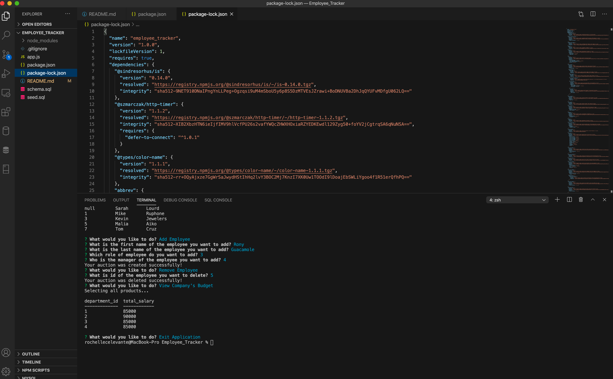

# Employee Tracker

A command-line application to manage a company's employee database, using Node.js, Inquirer, and MySQL.

# Table of Contents 
[User Story](#UserStory)  

[How to use application](#How-to-use-application) 

[Challenges](#Challenges)

[Languages](#Languages) 

[Author](#Author) 

# User Story

AS A business owner

I WANT to be able to view and manage the departments, roles, and employees in my company

SO THAT I can organize and plan my business

# How to use application

* run  `npm install`
    to install all dependencies. ( MySql, Inquirer and console.table)

* Go to the connection on app.js and change the username and password to access your local Database.

* Run `source schema.sql` and `source seed.sql` in your mySql Command Line
(Feel free to use Mysql Workbench as well)

* Type `node app.js` into your command line

* Navigate by using your arrow keys

# Preview
Click to watch the video

# Challenges

The challenges that I encountered in this project is (#1) connecting to the database. After I sort that out, when I run my sql script, it keeps giving me an error. I realized that it is better to run schema.sql without choosing the database. 

(#2) My seed.sql had some syntax error which I could not figure out. I finally called for a TA to help me. Shout out to John(TA) for helping me. We couldn't really figure out the syntax error but we just went with the one he provided. It might have been due to me installing a suggested mysql app into my vs code. 

Then, promises (#3) ! Initially, I had my connection in a different file and connected it to my app.js using require. For some reason, I was having trouble doing that so I stopped wasting my time and just did the connection to my database inside app.js. With all the changes, I edited my functions accordingly and eventually came down to having errors here and there from all the changes. I went from switch cases statements to if and else and back to switch. Also, once everything was working, the answers are not on a table but it gives me an array. Realize I console logged all functions instead of console.table.

Then, the logo(#4) ! the least I could stress about is the logo. For some reason, I want to make it happen. But I couldn't! I looked at all possible documentation about it.

After all my challenges, I finally got it to work. I thought this project was going to be an easy one for me but just a lot more codes. It ended up being more challenging than I thought. Nonetheless, I enjoyed it!

# Languages 

* Vanilla Javascript
* NodeJs
* Inquirer 
* MySql

# Author

Rochelle Ruiz
